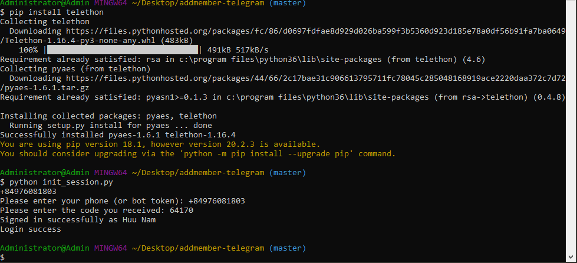
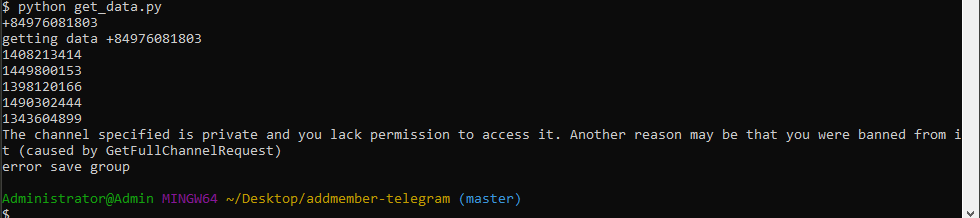
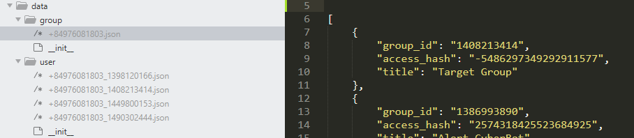
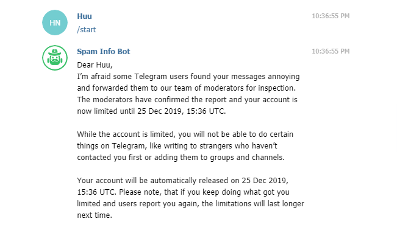

# addmember-telegram
Use `python 3` to add member from Group A to Group B (migrate members of your group)


## Require
* Environment of python 3 (Linux, Window)
* Need about 20 accounts to run (Switches accounts automatically when blocked)
* Each account needs to be in Source Group and Target Group
* Notice your region phone
* Your group must be a Super group

https://www.wikihow.com/Convert-a-Telegram-Group-to-a-Supergroup-on-PC-or-Mac


## Guide line

* Step 1: Install package `telethon`
```
pip install telethon
```

* Step 2: Create file config.json
Copy file config.json from config.example.json

```
{
	"group_target": 1398120166, --> id target group
	"group_source": 1490302444, --> id source group
	"accounts": [ --> array account
		{
			"phone": "+84XXXX",
			"api_id": 1234566,
			"api_hash": "57c6f3c72c2f21676d53be2eXXXXXX"
		}
	]
}
```
`group_target` and `group_source`: after running get_data.py, check files in data/group
`accounts`: list your Telegram accounts; and for each accounts/phone, create an app in https://my.telegram.org/apps and copy the `api_id` and  `api_hash` into the config file.

* Step 3: After setting up your `config.json` file, run `python init_session.py`, enter phone and the code you received



* Step 4: run `python get_data.py` to get data of group, data user and save file in folder `data`




```
{
    "user_id": "847587728",
    "access_hash": "2393668282771176567",
    "username": "None"
}
```
One group have one list user (list username), but each account Telegram have list User (difference user_id, access_hash). Use `user_id` and `access_hash` to add member, so you need get list user of each account Telegram.
Note: Use username have also use to add member, but something use not have username

After run get data, check again file in data/group and edit file config to change group_target, group_source, which you want to add.

* Step 5: run `python add_member.py` to add member from `group_source` to `group_target`
Logic: 
	* after adding 1 member, sleep 2 minutes
	* after each account adds 35 members --> sleep 15 minutes
	* Remove account when there is a Flood Wait Error
	* Break if there are no more accounts

Note: If your account gets blocked, go to https://web.telegram.org/#/im?p=@SpamBot and chat /start to see the time the ban would be lifted



Done!

## Ps: 
This repo is now actively being maintained and updated by:
south1907 and DanielTheGeek.

Create a new issue if you have legit issues and we will do our best to resolve them.

## Contributing:
* Fork the repo on Github
* Clone the repo using `git clone addmember-telegram`
* Make changes and stage the files: `git add .`
* Commit the changes: `git commit -m "Changed a few things"`
* Push the changes to your Github repo: `git push -u origin main`
* Submit a pull request.
