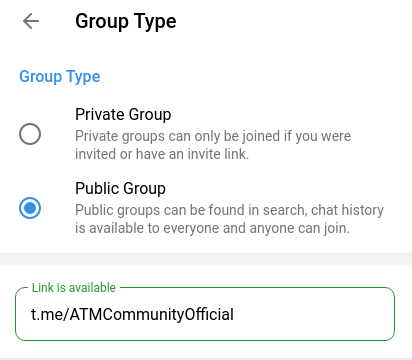
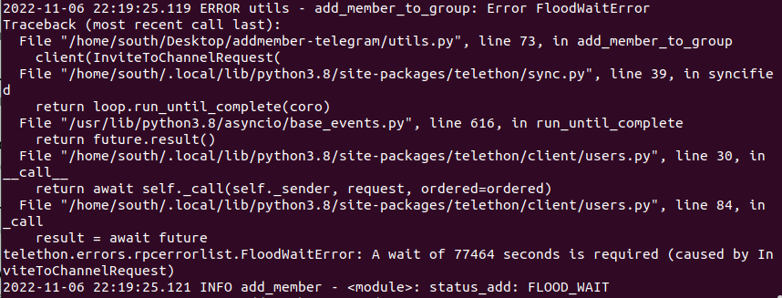
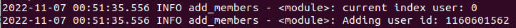

[](https://www.buymeacoffee.com/heva)

# addmember-telegram
Use `Python` to add member from Source Group to Target Group (migrate members of your group)


## Requirement
* The environment of python 3 (Linux, Windows)
* Need about 20 accounts to run (Switches accounts automatically when blocked)
* Your group must have a username (public group)
* Account have permission to add members to your Target Group (not need to join, the script will be auto join target group)
* Source group is a public group or accounts have joined Source Group




### Guide line

[Video Tutorial](https://youtu.be/qnNsgHCMQYk)

<details>
  <summary>Show more</summary>

  Note: On Windows, use `pip` instead of `pip3`, `python` instead of `python3`
  
 * Step 1: Install package `telethon` `readchar`
 ```
 pip3 install telethon
 
 pip3 install readchar
 ```

 or

 ```
 pip3 install -r requirements.txt
 ```

 Note: 
 
 * Step 2: Create file config.json base on config.example.json
 
 
 ```
 {
  "group_source": "atmcommunityvn",
  "group_target": "ATMCommunityOfficial",
  "api_id": 1234566,
  "api_hash": "57c6f3c72c2f21676d53be2eXXXXXX",
  "from_date_active": "20201114",
  "accounts": [
    "+84Heva",
    "+84Love",
    "+84Have"
  ]
}
 ```
 > `group_source`: username of Group Source

 > `group_target`: username of Group Target

 > `api_id` and `api_hash`: Need only one (`api_id` and `api_hash`), how to get them: create an app in https://my.telegram.org/apps and copy the `api_id` and  `api_hash` into the config file

 > `group_target`: username of Group Target

 > `accounts`: list String of your phones


 * Step 3: After setting up your `config.json`, run `python3 init_session.py`, enter phone and the code you received

 

 * Step 4: run `python3 get_members.py` to get data user and save file in folder `data` with path: `data/atmcommunityvn.json` (`atmcommunityvn` is username's Source Group)


 ```
 {
    "user_id": 847587728,
    "access_hash": 2393668282771176567,
    "username": None
 }
 ```

 Use `user_id` and `access_hash` to add member. Use username have also use to add member, but something use not have username

 One folder is created in folder `data` and have some file `.json` save data of members. If you change accounts (add more account) you need re-run `python3 get_members.py`.


 * Step 4: run `python3 add_members.py` to add member from `group_source` to `group_target`
 Logic: 
	* after adding 1 member, sleep 120s / total_client. If you have 2 accounts, it will sleep 60s
	* after each account adds 35 members --> sleep 2 hours
	* Remove account when there is a Flood, Flood Wait Error
	* Break (press CTRL + C) if there are no more accounts

 Note: If your account gets blocked, go to https://web.telegram.org/k/#@SpamBot and chat /start to see the time the ban would be lifted

 

 If your account is not blocked, but error `FloodWaitError`, in Terminal like as:

 

 and you must wait 77464 seconds
 
 > You can Stop The script By crtl+z or crtl+c. type y

 Note: current_count.txt save current index. If It is interupt, please check number index in file. If note current index (base on log in Terminal), edit it to correct and re-run.

 

</details>


## Community Group

Telegram Group Official: [ATM Community Official](https://t.me/amtcommunityoffcial)

Telegram Group of Vietnamese: [ATM Community (Việt Nam)](https://t.me/atmcommunityvn)

## Request New Feature
[Write your request](https://github.com/south1907/addmember-telegram/discussions/72)

## Share your story
[Write your story](https://github.com/south1907/addmember-telegram/discussions/74)

## Donation
- [Buy me a coffee](https://www.buymeacoffee.com/heva)
- [Ko-fi](https://ko-fi.com/hevapham)
- [Momo](https://me.momo.vn/AEI7uDFysmI9iBT8i8IR) - (Việt Nam)
- [Viettel Pay](https://vtpay.page.link/GNUPHZyJx2JU2xN6A) - (Việt Nam)

If this project help you, you can give me a cup of coffee ☕☕☕
Your donation will make me have more motivation to research, update, turning, build super super feature for the Project.


[](https://ko-fi.com/hevapham)

## Special Thanks

Updating
